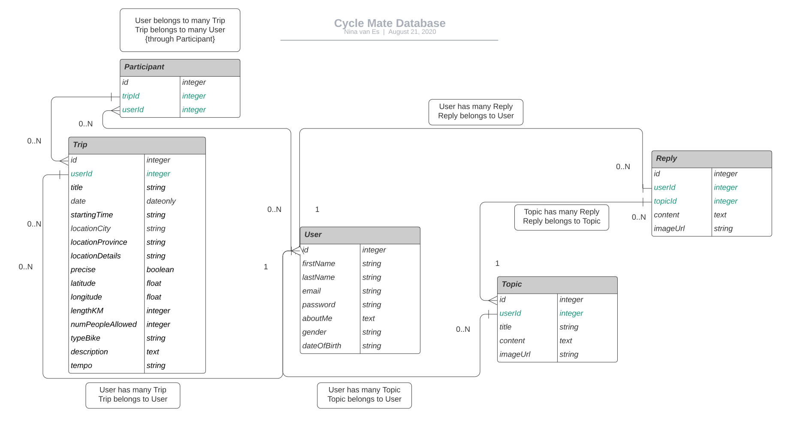

# Cycle Mate 🚴 Enjoying our love for cycling together

## [Frontend repository](https://github.com/grakify90/Portfolio_project_frontend)

## Database Model

## All Endpoints

**USER**

- POST /login = get token
- POST /signup = creates new user and get token
- 🔒 GET /me = get own data
- 🔒 PATCH /update = update own user data
- 🔒 PATCH /updatepassword = update own password

**TOPICS**

- GET /topics get = all topics (user (topic creator) included, replies included)
- GET /topics/:topicId = one topic (user (topic creator) included, replies included and user (reply creators) included)
- 🔒 POST /topics = create a topic for logged in user
- 🔒 PATCH /topics/:topicId = update a topic for logged in user

**REPLIES**

- 🔒 POST /replies/:topicId = create a reply to specific topic for logged in user
- 🔒 PATCH /replies/:replyId = update a reply for logged in user
- 🔒 DELETE /replies/:replyId = delete a reply for logged in user

**TRIPS**

- GET /trips = all trips including user (owner) and user (participants) with pagination, exluding ones that are in the past
- GET /trips/:tripId = one trip including user (owner) and user (participants)
- 🔒 GET /trips/oneuser = all trips for one user as participant, exluding ones that are in the past
- 🔒 POST /trips = create a trip for logged in user and add user as first participant to this trip (geocoding API included to pinpoint starting location)

**PARTICIPANTS**

- 🔒 POST /participants/:tripId = create new participant (logged in user) for specific trip
- 🔒 PATCH /participants/:tripId = update new participant (logged in user) for specific trip (works for both creating and deleting)
- 🔒 DELETE /participants/:tripId = delete participant (logged in user) for specific trip
